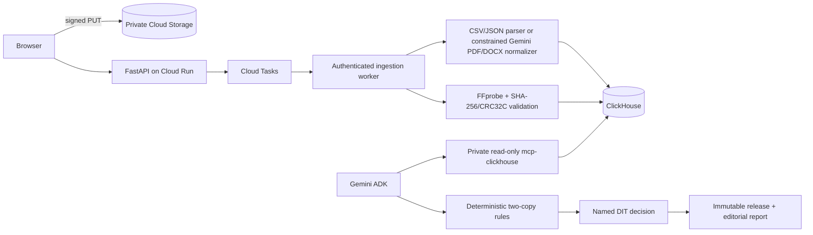

# WrapCheck

> A production media-handoff release gate for DITs and assistant editors.

WrapCheck answers one practical question before source cards are erased:

**Did every camera and production-sound file reported on set reach two distinct backups with matching hashes?**

It reconciles camera, sound, and script reports against a physical media manifest. Missing media, one-copy deliveries, and hash mismatches become exact recovery actions. A named DIT—not Gemini—makes the final immutable release decision.

## Real demo delivery

The repository includes an original miniature film delivery, not a product walkthrough:

- Three 7.2-second, 720p/24 fps H.264 camera clips with slate/timecode and scratch audio.
- Separate 48 kHz, 24-bit production WAV files for Takes 5, 6, and 7.
- Deterministic CSV reports and manifests containing measured sizes and real SHA-256 hashes.
- `problem-delivery.zip`: Take 7 sound is absent and the A017 secondary video copy is pending.
- `recovered-delivery.zip`: all six files have matching verified hashes on two destinations.

Regenerate every asset and both ZIP packages:

```bash
bash scripts/generate_demo_delivery.sh
```

The generator requires FFmpeg, FFprobe, Python, and Pillow. The original rights-safe source still is at `fixtures/demo_delivery/source/station-office.png`.

## Run locally

```bash
cp .env.example .env
docker compose up --build -d
```

Open <http://localhost:3000>.

Use **Load problem delivery** for the one-click judge path, **Download sample delivery** to inspect the real ZIP, or upload its extracted files through the same ingestion APIs. Select a take row to play its camera clip and separate production sound. Resolve both problem findings, enter the DIT's name, release the cards, and download the editorial handoff report. Then load the recovered delivery to demonstrate zero blockers while human release is still required.

The exact live presentation wording is in [docs/demo/DEMO_SCRIPT.md](docs/demo/DEMO_SCRIPT.md).

## Production pipeline



CSV and JSON are parsed deterministically. In live mode, Gemini may normalize semi-structured PDF/DOCX rows into strict schemas and summarize retrieved evidence. It cannot assert that an object exists, verify a checksum, resolve a finding, or release media. Uploaded document text is treated as untrusted data.

Delivery, asset, copy, job, run, decision, release, idempotency, and request-audit state is append-only in ClickHouse and reconstructed with `argMax`. Local fixture mode uses the same reconciliation policy and is clearly labelled; the production path uses private GCS, Cloud Tasks, Vertex AI, ClickHouse Cloud, and private read-only MCP.

## API

- `POST /api/deliveries` — create a draft delivery.
- `POST /api/deliveries/{delivery_id}/upload-targets` — validate declarations and issue signed/private upload targets.
- `PUT /api/deliveries/{delivery_id}/assets/{asset_id}/content` — local-mode streaming upload target.
- `POST /api/deliveries/{delivery_id}/ingestions` — finalize uploads and idempotently enqueue ingestion.
- `GET /api/ingestions/{job_id}` — stage, progress, error, and resulting run.
- `GET /api/deliveries/{delivery_id}` — durable delivery and assets.
- `GET /api/demo-packages/{problem|recovered}` — downloadable sample ZIP.
- `GET /api/handoff/config` — scenarios and live readiness.
- `POST /api/handoff/runs` — backward-compatible curated run.
- `GET /api/handoff/runs/{run_id}` — durable current result.
- `POST /api/handoff/findings/{finding_id}/decision` — recovered, exception, or review.
- `POST /api/handoff/runs/{run_id}/release` — immutable named-DIT release.
- `GET /api/handoff/runs/{run_id}/report` — printable/text handoff.

API failures use `{ "error": { "code", "message", "retryable", "request_id" } }`. Playback uses short-lived signed URLs in live mode; storage objects are never public.

## Live configuration

Apply all files under `clickhouse/init/` to ClickHouse Cloud. Give the application identity write access and the MCP identity `SELECT` only. Configure secrets through Secret Manager rather than committing credentials:

```bash
APP_MODE=live
GOOGLE_CLOUD_PROJECT=your-project
GOOGLE_CLOUD_LOCATION=us-central1
GEMINI_MODEL=gemini-3.5-flash
CURATED_MEDIA_BUCKET=private-wrapcheck-media
CLOUD_TASKS_QUEUE=wrapcheck-ingestion
CLOUD_TASKS_SERVICE_ACCOUNT=wrapcheck-tasks@your-project.iam.gserviceaccount.com
CLOUD_RUN_BACKEND_URL=https://your-private-backend.run.app
CLICKHOUSE_HOST=your-service.clickhouse.cloud
CLICKHOUSE_PORT=8443
CLICKHOUSE_SECURE=true
CLICKHOUSE_DATABASE=wrapcheck
CLICKHOUSE_USER=wrapcheck_app
CLICKHOUSE_PASSWORD=secret
CLICKHOUSE_MCP_URL=https://your-private-mcp-service/mcp
DEMO_QUOTA_SECRET=a-long-random-secret
```

Use separate least-privilege identities for API writes, ingestion, URL signing, and MCP reads. Keep the MCP and internal ingestion endpoint private. Configure a 24-hour object lifecycle and Cloud Run instance/request limits.

## Verification

```bash
PYTHONPATH=backend pytest -q backend/tests
cd frontend && npm run build
```

The suite covers exact problem/clean outcomes, two-copy matching, one-copy media, hash conflicts, file signatures and limits, real demo hashes, durable decisions, release immutability, and MCP response parsing.

## Submission positioning

**Problem:** cards can be erased or leave set before a missing sound file or incomplete second backup is noticed.

**Outcome:** every reported take, sound file, and backup hash is reconciled before a human releases the cards.

This is not footage search, continuity guessing, autonomous erasure, or an AI editing tool.

## License

Apache-2.0. See [LICENSE](LICENSE).
