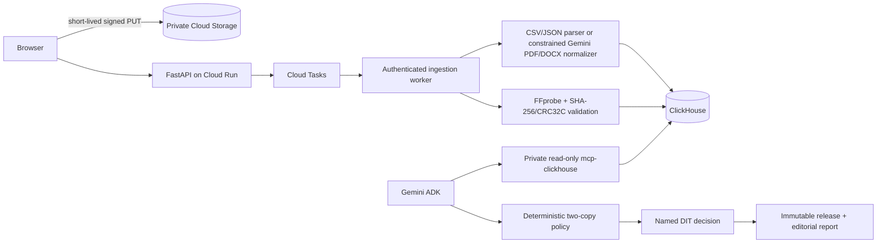

# WrapCheck

> A production media-handoff release gate for DITs and assistant editors.

[Launch the live application](https://wrapcheck-web-chcs5wu3qa-uc.a.run.app/) | [Security](SECURITY.md) | [MIT License](LICENSE)

Built for the **Google Cloud Agentic Cinema Hackathon** in the **ClickHouse Partner Track**.

WrapCheck answers one practical question before source cards are erased:

**Did every camera and production-sound file reported on set reach two distinct backups with matching hashes?**

It reconciles camera, sound, and script reports against a physical media manifest. Missing media, single-copy deliveries, and hash mismatches become exact recovery actions. A named DIT—not an AI model—makes the final immutable release decision.

## What judges can test

The hosted build is a production-backed hackathon MVP, not a static concept or prerecorded walkthrough. It includes:

- A one-click problem delivery with exactly two blockers: missing `SR12_024B_T07.wav` and incomplete second-copy verification for card A017.
- A recovered delivery with zero blockers and a mandatory named-human release.
- Playable original camera footage and separate production-sound evidence.
- Private direct-to-Cloud-Storage uploads for unpacked production deliveries.
- Durable ClickHouse runs, findings, human decisions, releases, jobs, and telemetry.
- Live Gemini-assisted document normalization and evidence retrieval through the official private, read-only ClickHouse MCP service.
- Deterministic file, hash, and two-destination release rules that the model cannot override.

## Why it matters

Discovering missing production sound or an incomplete backup after a camera card has been formatted can force an expensive recovery or reshoot. WrapCheck moves that check to the moment when the source cards and crew are still available.

WrapCheck deliberately does not:

- Decide whether cards should be erased autonomously.
- Treat visual analysis as proof that a file was copied safely.
- Let Gemini assert file existence, verify hashes, resolve findings, or release media.
- Present fixture activity as live Google Cloud or MCP activity.

## Try the real demo delivery

The repository contains an original miniature film delivery rather than a walkthrough video:

- Three 7.2-second, 1280×720, 24 fps H.264 camera clips with slate/timecode and scratch audio.
- Separate 48 kHz, 24-bit production WAV files for Takes 5, 6, and 7.
- Deterministic CSV reports with measured sizes and real SHA-256 hashes.
- `problem-delivery.zip`: Take 7 sound is absent and A017's secondary video copy is pending.
- `recovered-delivery.zip`: all six media files have matching verified hashes on two destinations.

### Hosted one-click path

1. Open the [live WrapCheck application](https://wrapcheck-web-chcs5wu3qa-uc.a.run.app/).
2. Select **Load problem delivery** and wait for **Hold source cards**.
3. Select **24B / Take 7** to play the camera evidence and show that its separate production WAV is missing.
4. Review the missing-audio and incomplete-backup recovery actions.
5. After the physical recovery steps are complete, record both findings as recovered.
6. Enter the DIT’s name, release the delivery, and open the editorial handoff report.
7. Select **Load recovered delivery** to confirm zero blockers with named human release still required.

### Upload the sample through the production pipeline

Select **Download sample delivery**, extract the ZIP, then choose all four reports and the MP4/MOV and WAV assets under **Use your own unpacked delivery**. The browser sends media directly to private Cloud Storage; the authenticated worker validates, hashes, persists, retrieves, and reconciles the delivery.

### Run locally

Start the complete local stack:

```bash
cp .env.example .env
docker compose up --build -d
```

Open <http://localhost:3000> and choose one of three paths:

1. **Load problem delivery** to demonstrate the two exact blockers.
2. **Download sample delivery**, extract it, and upload the files through the real ingestion API.
3. **Load recovered delivery** to demonstrate zero blockers with named human release still required.

Select a take row to play its camera clip and separate production WAV. Resolve the problem findings, enter the DIT's name, release the cards, and open the editorial handoff report.

The concise presentation flow is in [docs/demo/DEMO_SCRIPT.md](docs/demo/DEMO_SCRIPT.md).

## Regenerate the demo assets

```bash
bash scripts/generate_demo_delivery.sh
```

The generator requires FFmpeg, FFprobe, Python, Pillow, and the macOS `say` command. The rights-safe source still is stored at `fixtures/demo_delivery/source/station-office.png`. Package generation is idempotent: old archives are replaced before new files are written.

## Architecture



CSV and JSON reports are parsed deterministically. In live mode, Gemini may normalize semi-structured PDF/DOCX rows into strict schemas and summarize retrieved evidence. Uploaded document text is untrusted data and cannot change tool permissions or release policy.

Deliveries, assets, copy records, ingestion jobs, runs, decisions, releases, idempotency records, and request telemetry are stored in ClickHouse. Latest state is reconstructed from append-only snapshots with `argMax`. The official `mcp-clickhouse` service uses a separate read-only ClickHouse identity.

## Upload and release policy

- Reports: CSV, JSON, PDF, or DOCX; maximum 10 MB each.
- Media: MP4, MOV, or WAV; maximum 500 MB each.
- Delivery limit: 20 assets and 1 GB per session.
- Archives and macro-enabled documents are rejected.
- Extensions, declared MIME types, object sizes, signatures, CRC32C, and SHA-256 are validated.
- Media metadata is extracted with FFprobe.
- Every expected file needs matching verified hashes on two distinct destinations.
- Findings must be resolved or explicitly reviewed before release.
- Final release requires a named human and becomes immutable.

## API

| Method | Endpoint | Purpose |
| --- | --- | --- |
| `POST` | `/api/deliveries` | Create a draft delivery. |
| `POST` | `/api/deliveries/{delivery_id}/upload-targets` | Validate declarations and issue private upload targets. |
| `PUT` | `/api/deliveries/{delivery_id}/assets/{asset_id}/content` | Stream an asset in local mode. |
| `POST` | `/api/deliveries/{delivery_id}/ingestions` | Idempotently enqueue ingestion. |
| `GET` | `/api/ingestions/{job_id}` | Read stage, progress, error, and resulting run ID. |
| `GET` | `/api/deliveries/{delivery_id}` | Read durable delivery and asset metadata. |
| `GET` | `/api/demo-packages/{problem\|recovered}` | Download a sample delivery. |
| `POST` | `/api/handoff/runs` | Run the backward-compatible curated workflow. |
| `GET` | `/api/handoff/runs/{run_id}` | Reconstruct a persisted handoff run. |
| `POST` | `/api/handoff/findings/{finding_id}/decision` | Record recovery, exception, or review. |
| `POST` | `/api/handoff/runs/{run_id}/release` | Record immutable named-DIT release. |
| `GET` | `/api/handoff/runs/{run_id}/report` | Produce the editorial handoff report. |

API failures use:

```json
{
  "error": {
    "code": "validation_error",
    "message": "Request validation failed.",
    "retryable": false,
    "request_id": "..."
  }
}
```

## Live configuration

Apply the migrations under `clickhouse/init/` to ClickHouse Cloud. Give the application identity write access and the MCP identity `SELECT` only. WrapCheck uses Vertex AI through Application Default Credentials; a standalone Gemini API key is not required.

Store live values in Secret Manager rather than committing them:

```bash
APP_MODE=live
GOOGLE_CLOUD_PROJECT=your-project
GOOGLE_CLOUD_LOCATION=us-central1
GEMINI_MODEL=gemini-2.5-flash
CURATED_MEDIA_BUCKET=private-wrapcheck-media
CLOUD_TASKS_QUEUE=wrapcheck-ingestion
CLOUD_TASKS_SERVICE_ACCOUNT=wrapcheck-tasks@your-project.iam.gserviceaccount.com
CLOUD_RUN_BACKEND_URL=https://your-private-backend.run.app
CLICKHOUSE_HOST=your-service.clickhouse.cloud
CLICKHOUSE_PORT=8443
CLICKHOUSE_SECURE=true
CLICKHOUSE_DATABASE=wrapcheck
CLICKHOUSE_USER=wrapcheck_app
CLICKHOUSE_PASSWORD=secret
CLICKHOUSE_MCP_URL=https://your-private-mcp-service/mcp
CLICKHOUSE_MCP_AUDIENCE=https://your-private-mcp-service
DEMO_QUOTA_SECRET=a-long-random-secret
```

Production deployment should also:

- Use separate least-privilege identities for API writes, ingestion, URL signing, and MCP reads.
- Keep MCP and the internal Cloud Tasks endpoint private.
- Require authenticated service-to-service Cloud Tasks requests.
- Set a 24-hour lifecycle on public demo uploads and temporary packages.
- Configure Cloud Run instance, request-size, per-session, and global quotas.
- Rotate credentials immediately if they are exposed.

See [SECURITY.md](SECURITY.md) for the threat model, deployment checklist, and vulnerability-reporting process.

## Verification

```bash
docker compose exec -T backend python -m pytest -q
cd frontend && npm run build
```

The current suite contains 39 backend tests covering exact problem/recovered outcomes, two-copy matching, one-copy media, conflicting hashes, content signatures and MIME policy, real demo hashes, package uniqueness, FFprobe metadata, durable decisions, release immutability, and MCP response parsing.

The verified end-to-end results are:

- Problem package: `checksum_pending` and `missing_audio` only.
- Recovered package: zero findings, `ready_for_release`, human release still required.
- Human decisions survive a backend restart and remain available for report generation.

## Security

Do not use real unreleased footage or production credentials in the public demo environment. Never commit `.env`, service-account JSON, signed URLs, ClickHouse passwords, or customer media. The repository ignores common local secret and build files, but deployment operators remain responsible for secret scanning and access review.

Report vulnerabilities privately according to [SECURITY.md](SECURITY.md). Do not open a public issue for an unpatched security problem.

## Submission positioning

**Problem:** source cards can be erased or leave set before a missing sound file or incomplete second backup is noticed.

**Outcome:** every reported take, sound file, and backup hash is reconciled before a human releases the cards.

This is not footage search, continuity guessing, autonomous erasure, or an AI editing tool.

## License

WrapCheck is available under the [MIT License](LICENSE).
